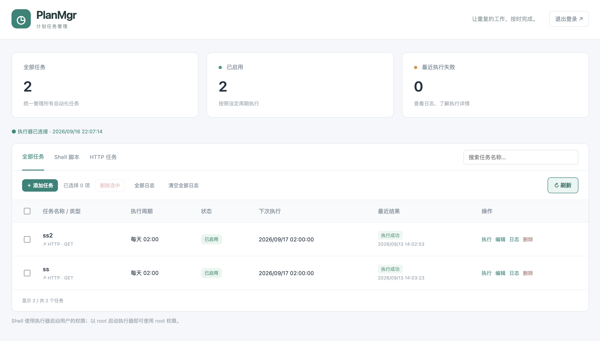
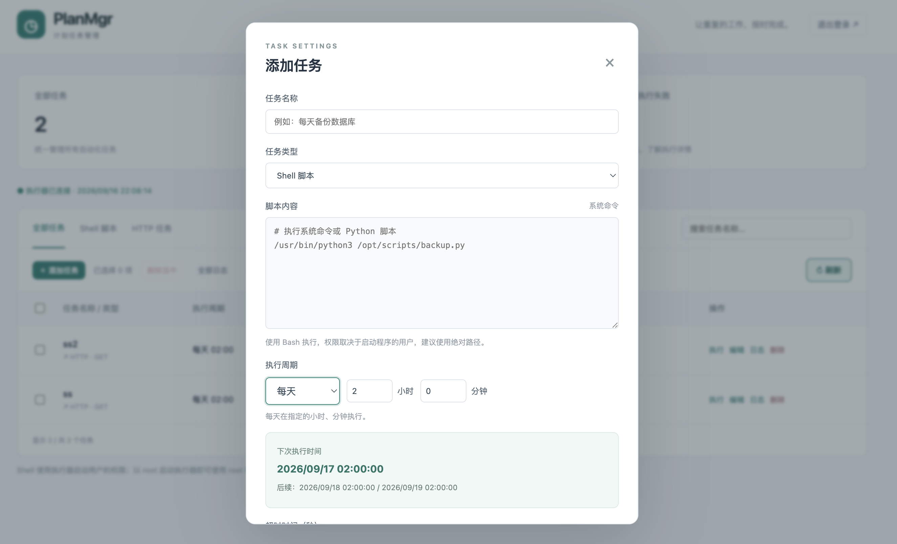

# PlanMgr 计划任务管理

一款简洁的定时任务管理系统；

支持 macOS 与 Linux，内置网页和 SQLite，无需安装运行环境；

支持 Shell / Python 脚本、HTTP GET / POST（键值参数或 JSON 请求体）、常用执行周期、批量操作和任务日志。首次打开网页设置管理员账号和密码。

## 页面预览

任务列表：



添加任务及执行周期预览：



## 系统与环境要求

| 安装包 | 系统要求 | CPU 架构 |
| --- | --- | --- |
| macOS | macOS 13 Ventura 或更新版本，安装时需要管理员授权 | Apple Silicon（arm64） |
| Linux | 面向 Ubuntu 安装器需要 systemd、Bash、root 或 sudo 权限 | ARM 64 位（arm64 / aarch64）；已有 amd64 包适用于 Intel / AMD 64 位 |

程序内置数据库及网页，无需安装 Go 或单独的数据库服务。

运行 Python 脚本时需另装 Python 3 及脚本依赖；HTTPS 任务需要系统 CA 证书（Ubuntu 的 `ca-certificates`）。使用现代浏览器并启用 JavaScript，默认端口 8600 需空闲。数据目录必须可写。

当前发行包使用 Go 1.27.1 构建，macOS 最低版本依据 [Go 官方系统要求](https://go.dev/wiki/MinimumRequirements)。

## macOS（Apple Silicon）

解压 `planMgr-go-darwin-arm64.zip`，双击 `安装并启动.command`，按提示输入 Mac 管理员密码。安装完成自动打开 http://127.0.0.1:8600。

- 安装为系统开机服务，重启后自动运行，任务使用安装用户的权限。
- 重复安装会更新程序并保留账号、任务和日志。
- 双击 `卸载并清理数据.command` 可卸载服务并删除全部数据。
- 程序目录：`~/Library/Application Support/PlanMgrGo/`
- 数据目录：上述目录下 `data/`。
- 自启动配置：`/Library/LaunchDaemons/cn.planmgr.go.<用户ID>.plist`。

## Linux（Ubuntu 22.04 / 24.04）

先用 `uname -m` 确认架构：`aarch64` 选择 arm64 包，`x86_64` 选择 amd64 包。以下以 arm64 为例。

普通用户使用 `sudo` 安装；如果已经登录 root，可省略命令中的 `sudo`。

```sh
tar -xzf planMgr-go-linux-arm64.tar.gz
cd planMgr-go-linux-arm64
sudo sh install-ubuntu.sh
```

通过 sudo 以 root 权限安装。安装器注册并启用 systemd 服务，开机自动启动，任务使用 root 权限。

默认仅本机访问 http://127.0.0.1:8600。需要通过服务器 IP 访问时，使用 `sudo nano /var/lib/planmgr-go/settings.json` 写入以下内容，然后重启服务（已有配置请编辑对应字段）：

```json
{"addr":"0.0.0.0:8600","timezone":"Asia/Shanghai"}
```

```sh
sudo systemctl restart PlanMgrGo
sudo systemctl status PlanMgrGo
sudo systemctl is-enabled PlanMgrGo
```

访问 `http://服务器IP:8600`，并按需放行服务器防火墙的 8600 端口。请限制管理页面的访问范围。

- 程序目录：`/opt/planmgr-go/`
- 数据目录：`/var/lib/planmgr-go/`
- 停止 / 启动：`sudo systemctl stop PlanMgrGo` / `sudo systemctl start PlanMgrGo`
- 卸载并保留数据：`sudo sh uninstall-ubuntu.sh`
- 卸载并清空数据：`sudo sh uninstall-ubuntu.sh --purge`

## 任务与重启

支持每天、N 天、每小时、N 小时、N 分钟、每星期、每月、N 秒，选择周期后显示下次执行时间。Python 任务需要系统安装 Python 及脚本依赖，请使用绝对路径。

任务和周期保存在数据库中，重启后自动继续调度；停机期间错过的周期不补执行，启动时重新计算下一次执行时间。重启前尚未完成的脚本不能断点续跑，会标记为执行中断。任务串行执行，耗时较长的任务会推迟后续任务；机器关机或睡眠时无法执行。

## 日志与备份

- 数据库：数据目录下 `tasks.sqlite`，保存账号、任务和执行日志。
- 点击“全部日志”按时间倒序查看所有任务记录，每页 50 条；点击记录查看详细输出。
- 任务日志：每个任务保留最近 **500 条**，持续淘汰旧记录；每次输出最多约 64KB。
- 删除任务会删除其日志；“清空全部日志”清除所有任务日志，保留任务。
- 服务日志：数据目录下 `logs/service.log`；macOS 另有程序目录下 `logs/launcher.log` 和 `logs/launcher-error.log`。

备份和还原前先停止服务，复制整个数据目录。还原时用备份目录替换原数据目录，避免新旧数据库文件混用，然后重新启动服务。外部脚本文件和 Python 依赖需单独备份或安装。

macOS 可使用以下命令停止和重新启动服务：

```sh
sudo launchctl bootout system/cn.planmgr.go.$(id -u)
sudo launchctl bootstrap system /Library/LaunchDaemons/cn.planmgr.go.$(id -u).plist
```

## 本地构建：

```sh
go mod download
go test ./...
python3 scripts/build.py --target darwin-arm64
python3 scripts/build.py --target linux-arm64
```

